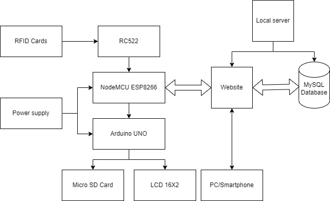
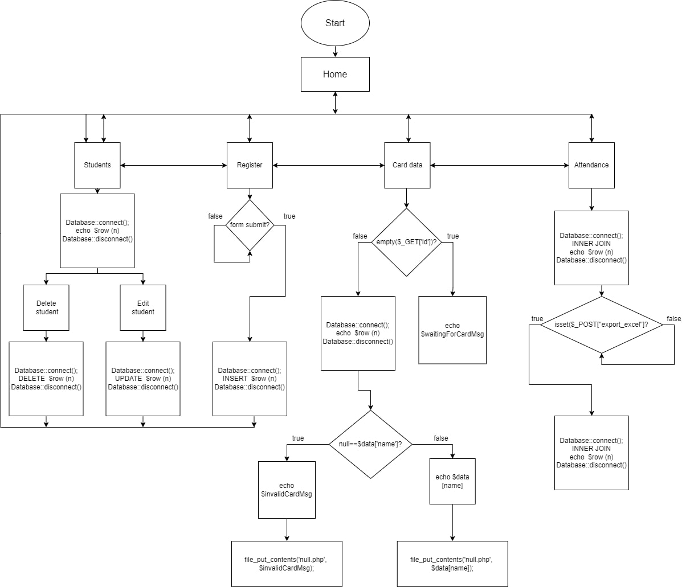

# PHP-NodeMCU-RFID-Attendance-logging-system
-The system is based on a NodeMCU and an Arduino UNO board (for the hardware device), a website created with PHP,HTML,CSS,Bootstrap,Javascript,jQuery and a MySQL database.

-The hardware device will read RFID cards, store their information, and send it to the website which will proccess the data and then modify it/store it in the SQL database, then send a response to the device so it can print a message on an LCD screen and also write the result on a micro SD card.

-The website allows the administrator to register,delete and even edit users and their registered RFID cards.The system displays the current registered attendance, logged on the final page in a table obtained by inner joining the 'users' and the 'logs' table, using MySQL queries.This final table can also be exported as an Excel file.

<h2>Project diagram</h2>

<h2>Website diagram</h2>

<h2>User data</h2>

<h2>User data edit page</h2>

<h2>User data delete page</h2>

<h2>Registration</h2>

<h2>Read tag</h2>

<h2>Attendance logs</h2>

<a href="https://github.com/chrisssCurry/IoT-RFID-Attendance-logging-system/tree/main/Preview"><h2>To download a Powerpoint presentation of the project, check the 'Preview' directory.</h2></a>
